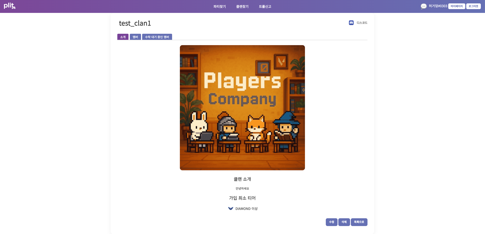
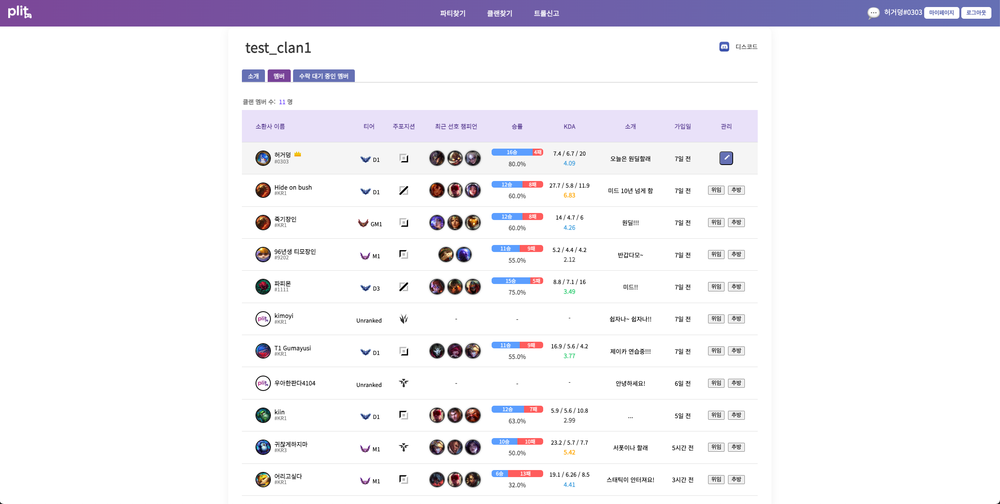
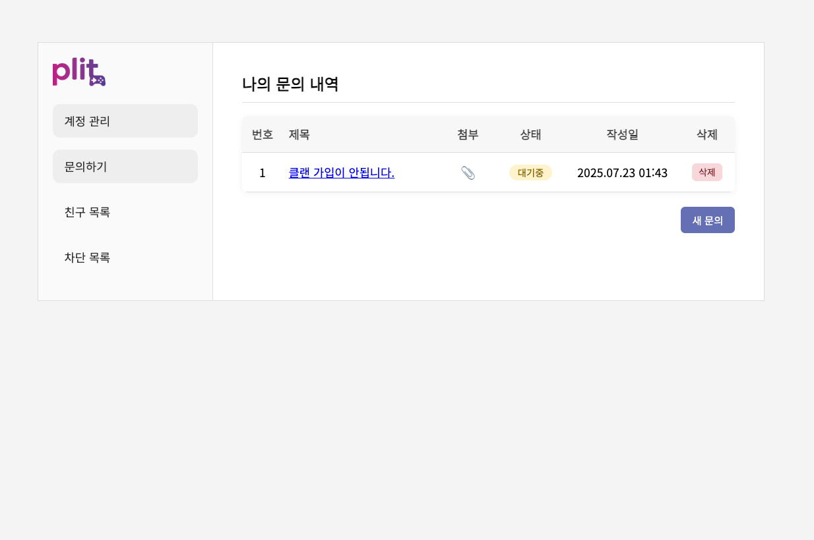
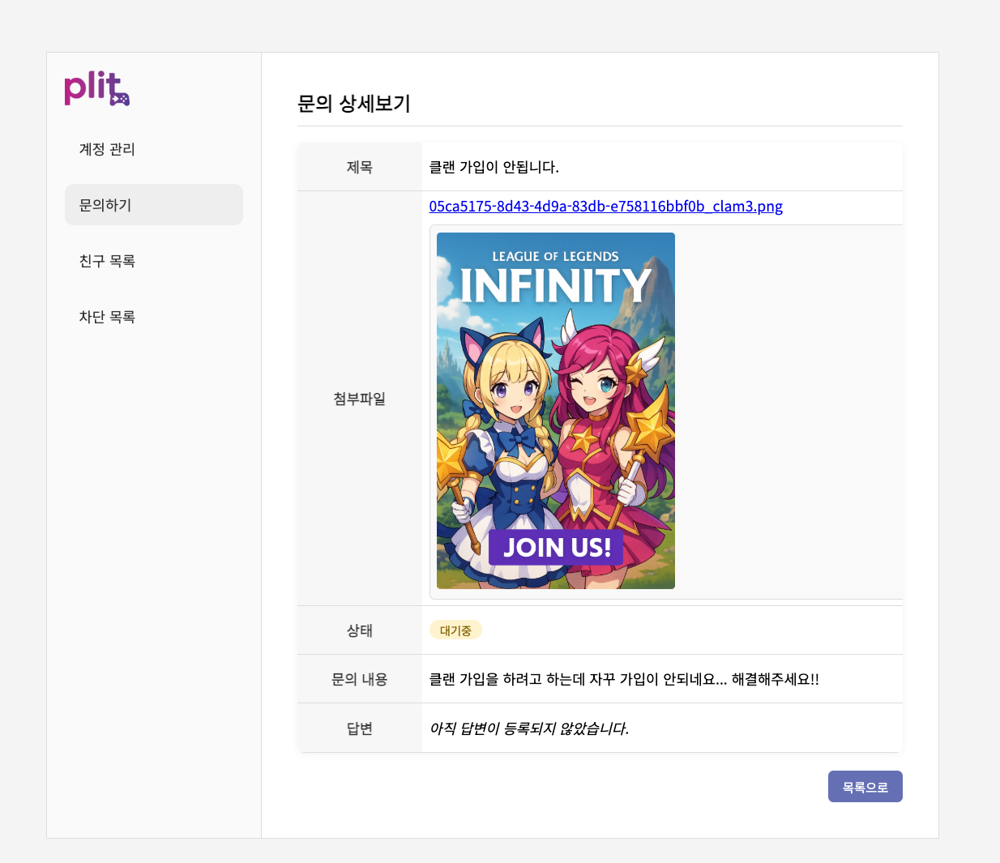
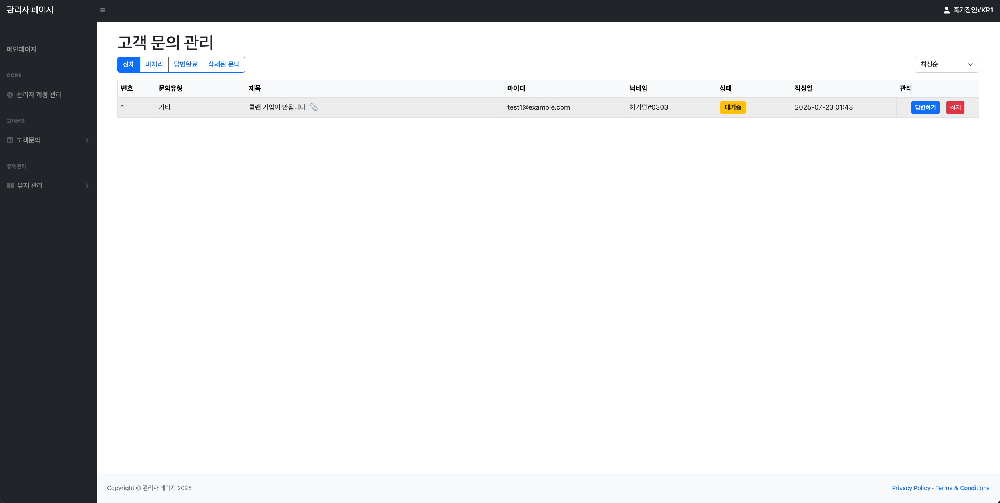

<!-- 헤더 웨이브 배경 -->
<p align="center">
  
</p>

<!-- 이름 + 직함 -->
<h1 align="center">🧑‍💻 송민석 (Song Min-seok)</h1>
<h3 align="center">신입 백엔드 개발자 | Spring Boot & Java 학습 중 💪</h3>

<!-- 애니메이션 문구 -->
<p align="center">
  
</p>

<!-- 기술 스택 배지 -->
<div align="center">
  
  
  
  
</div>

<!-- 개발자 이미지 -->
<p align="center">
  
</p>

---

## 🚀 **자기소개**

> **신입 백엔드 개발자**로서 Spring Boot와 Java 개발을 열심히 학습하고 있으며, RESTful API 설계와 데이터베이스 아키텍처에 관심을 가지고 있습니다.

```java
public class SongMinseok {
    private String name = "송민석";
    private String role = "신입 백엔드 개발자";
    private String email = "mseoki55@gmail.com";
    private String[] skills = {"Spring Boot", "JPA", "Spring Security", "MySQL"};
    private String passion = "꾸준한 학습과 성장";
    
    public void code() {
        while (true) {
            learn();    // 학습
            practice(); // 연습
            grow();     // 성장
        }
    }
}
```

- 🌱 **Java 백엔드** 개발을 열심히 학습하고 있습니다.
- 💡 **RESTful API 설계**와 **데이터베이스 아키텍처**에 관심을 가지고 있습니다.
- ✨ **Spring Boot, JPA, Spring Security**를 활용한 프로젝트를 완성했습니다.
- 🔥 목표는 **실력 있는 백엔드 개발자**가 되는 것!
- 🎯 "꾸준함은 배신하지 않는다."는 마음으로 하루하루를 채워가고 있어요.

---

## 🎯 **주요 프로젝트: Plit**

### 📋 **프로젝트 개요**
- **프로젝트명**: Plit (게임 매칭/파티 시스템)
- **개발 기간**: 멀티캠퍼스 백엔드 3회차 부트캠프 최종 프로젝트
- **담당 역할**: 백엔드 API 개발 (클랜 & QnA 시스템)
- **기술 스택**: Spring Boot, JPA, Spring Security, MySQL, AWS S3

### 🏗️ **시스템 아키텍처**

<div align="center">

| **계층** | **역할** | **기술 스택** |
|----------|----------|---------------|
| **📡 컨트롤러** | REST API 엔드포인트 제공 | Spring Boot, Spring Security |
| **⚙️ 서비스** | 비즈니스 로직 처리 | Spring Service, Transaction |
| **🗄️ 리포지토리** | 데이터 접근 및 관리 | JPA, Hibernate |
| **🔐 보안** | 인증 및 권한 관리 | Spring Security, OAuth2 |
| **☁️ 파일 저장** | 이미지 및 파일 업로드 | AWS S3, MultipartFile |
| **💾 데이터베이스** | 데이터 영속성 | MySQL, JPA |

</div>

**🔄 데이터 흐름:**
```
클라이언트 요청 → 컨트롤러 → 서비스 → 리포지토리 → 데이터베이스
     ↑                                                      ↓
     ←─────────────── 응답 ────────────────────────────────←
```

---

## 🛠️ **핵심 기능**

### 🏰 **클랜 시스템 API**
<details>
<summary><b>📁 개발 파일</b></summary>

- `ClanController.java` (629줄) - RESTful API 엔드포인트
- `ClanService.java` - 비즈니스 로직 및 트랜잭션 관리
- `ClanRepository.java` - JPA 데이터 접근 계층
- `Clan Entity` - 도메인 모델

</details>

<details>
<summary><b>⚙️ 주요 기능</b></summary>

- ✅ **CRUD 작업**: 완전한 클랜 관리
- ✅ **멤버 관리**: 역할 기반 접근 제어
- ✅ **파일 업로드**: AWS S3 통합
- ✅ **보안**: Spring Security 통합
- ✅ **검증**: 요청/응답 검증

</details>

<details>
<summary><b>💻 핵심 API 예시</b></summary>

```java
@PostMapping("/clan")
@PreAuthorize("hasRole('USER')")
public ResponseEntity<ClanResponse> createClan(
    @Valid @RequestBody ClanCreateRequest request,
    @AuthenticationPrincipal UserDetails userDetails) {
    
    Clan clan = clanService.createClan(request, userDetails);
    return ResponseEntity.status(HttpStatus.CREATED)
        .body(ClanResponse.from(clan));
}
```

</details>

### ❓ **QnA 관리 시스템 API**
<details>
<summary><b>📁 개발 파일</b></summary>

- `QnaController.java` (242줄) - 관리자 API 엔드포인트
- `QnaService.java` - 답변 처리 및 이메일 알림
- `QnaRepository.java` - QnA 데이터 관리
- `Qna Entity` - 도메인 모델

</details>

<details>
<summary><b>⚙️ 주요 기능</b></summary>

- ✅ **CRUD 작업**: 완전한 QnA 관리
- ✅ **답변 시스템**: 관리자 응답 관리
- ✅ **이메일 알림**: 자동 이메일 알림
- ✅ **파일 처리**: 업로드 및 검증
- ✅ **상태 추적**: QnA 상태 관리

</details>

<details>
<summary><b>💻 핵심 서비스 예시</b></summary>

```java
@Transactional
public void answerQna(Long qnaId, QnaAnswerRequest request) {
    Qna qna = qnaRepository.findById(qnaId)
        .orElseThrow(() -> new QnaNotFoundException());
    
    qna.updateAnswer(request.getAnswer());
    qna.updateStatus(QnaStatus.COMPLETED);
    
    // 이메일 알림 발송
    emailService.sendQnaAnswerNotification(qna);
}
```

</details>

---

## 📸 **프로젝트 스크린샷**

### 🏰 **클랜 시스템**
<div align="center">
  
  <p><em>클랜 상세 페이지 - 소개, 멤버 관리, 권한 제어</em></p>
</div>

<div align="center">
  
  <p><em>클랜 멤버 관리 - 11명의 멤버 정보 및 통계</em></p>
</div>

### ❓ **QnA 관리 시스템**
<div align="center">
  
  <p><em>사용자 문의 내역 - 문의 목록 및 상태 관리</em></p>
</div>

<div align="center">
  
  <p><em>문의 상세보기 - 첨부파일, 상태, 답변 관리</em></p>
</div>

<div align="center">
  
  <p><em>관리자 문의 관리 - 전체 문의 목록 및 처리</em></p>
</div>

---

## 🎯 **기술적 도전과 해결**

| **도전 과제** | **해결 방법** | **사용 기술** |
|---------------|--------------|----------------|
| **복잡한 DB 관계** | JPA @ManyToMany, @OneToMany 매핑 | Spring Data JPA |
| **안전한 파일 업로드** | MultipartFile + S3 SDK 통합 | AWS S3 |
| **역할 기반 접근 제어** | Custom UserDetails + @PreAuthorize | Spring Security |
| **이메일 알림** | Spring Mail + SMTP 설정 | Gmail SMTP |

---

## 📊 **개발 성과**

<div align="center">

| **지표** | **수치** | **설명** |
|------------|-----------|-----------------|
| **백엔드 코드** | `871줄` | 컨트롤러 + 서비스 + 리포지토리 |
| **API 엔드포인트** | `15개+` | CRUD + 비즈니스 로직 |
| **데이터베이스 테이블** | `8개+` | 핵심 엔티티 및 관계 |
| **담당 범위** | `100%` | 백엔드 전담 |

</div>

---

## 🛠️ **기술 스택**

### 💻 **프로그래밍 언어**  
 
 
 


### 🧰 **백엔드 도구 & 프레임워크**  
 
 


 


### 🧑‍💻 **개발 도구**  
 
 
 


---

## 🧠 **주요 사용 언어**

<p align="center">
  
</p>

---

## 📈 **GitHub 통계**

<p align="center">
  
  
</p>

---

## 🎨 **개발 철학**

> **"꾸준한 학습과 성장하는 개발자"**

- 🔒 **보안 우선**: Spring Security를 통한 인증 및 인가
- 🏗️ **계층형 아키텍처**: 컨트롤러-서비스-리포지토리 패턴
- 📝 **RESTful 설계**: 표준 HTTP 메서드 및 상태 코드 활용
- 🧪 **테스트 주도**: 비즈니스 로직을 위한 단위 테스트
- 📚 **문서화**: 명확한 API 문서 작성

---

## 🌱 **현재 학습 중인 내용**

- 객체지향 프로그래밍 (OOP) 원리 이해
- Java & Spring Boot 기반 백엔드 구조
- MySQL 연동 및 JPA 고급 사용법
- AWS 클라우드 서비스 활용법
- 마이크로서비스 아키텍처 설계

---

## 🗂️ **앞으로 추가 예정**

- 🛠 사이드 프로젝트
- 🧪 알고리즘 풀이 기록
- 📚 블로그나 기술 기록 링크
- 🚀 마이크로서비스 프로젝트

---

<!-- 푸터 애니메이션 -->
<h3 align="center">
  
</h3>

<!-- 푸터 웨이브 -->
<p align="center">
  
</p>

<!-- 연락처 -->
<p align="center">
  📬 <strong>연락처</strong> &nbsp;|&nbsp;
  <a href="mailto:mseoki55@gmail.com">📧 mseoki55@gmail.com</a> &nbsp;|&nbsp;
  <a href="https://github.com/mseoki55">🔗 GitHub</a>
</p>

<p align="center">
  <em>"꾸준함은 배신하지 않는다 – 하루하루 성장하는 신입 백엔드 개발자 💻"</em>
</p>
